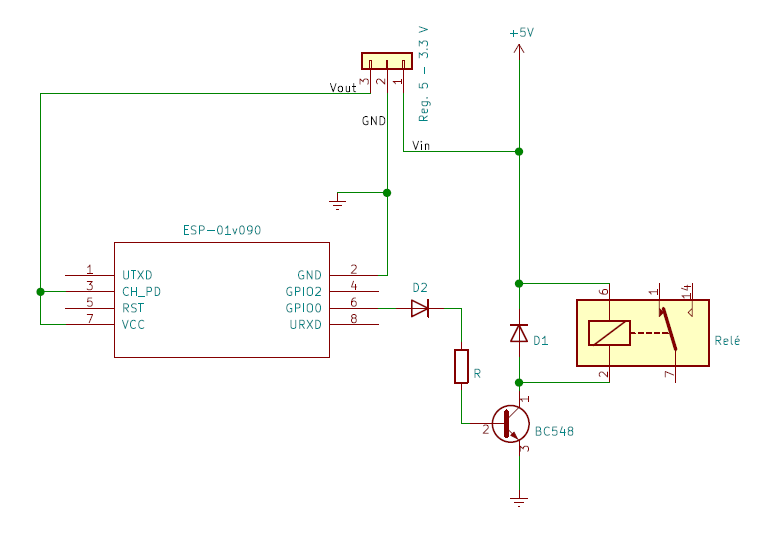
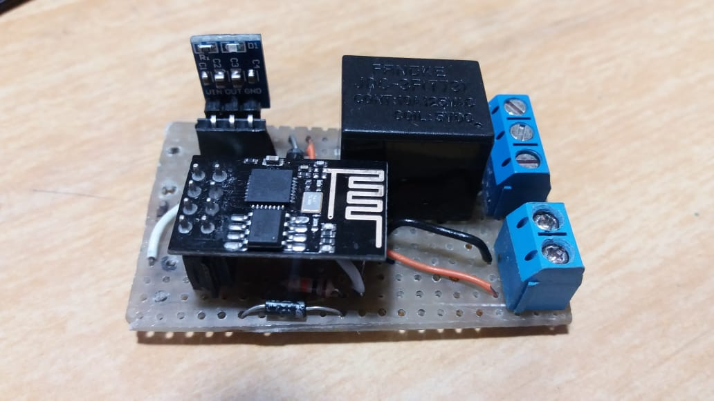

# Relé comandado por ESP8266-01

<h3>Materiais</h3>

- ESP8266-01
- Diodos IN4007
- Resistor 10K
- Relé 5V
- Fios para conexão
- Conectores borne

<h3>Esquemático</h3>



O diodo D2 foi adicionado porque, ao ligar o circuito, o transistor estava "travando" ao receber um sinal 0 do ESP8266-01. O diodo D2 impede a circulação de corrente nesse momento inicial.

O circuito foi montado em uma placa de fenolite ilhada.



<h3>Teste</h3>

Foi utilizada a biblioteca Blynk para controlar a saída do ESP8266-01 através de um smartphone.


```c
#define BLYNK_PRINT Serial

#include <ESP8266WiFi.h>
#include <BlynkSimpleEsp8266.h>

// You should get Auth Token in the Blynk App.
// Go to the Project Settings (nut icon).
char auth[] = "YourAuthToken";

// Your WiFi credentials.
// Set password to "" for open networks.
char ssid[] = "YourNetworkName";
char pass[] = "YourPassword";

void setup()
{
  // Debug console
  Serial.begin(9600);

  Blynk.begin(auth, ssid, pass);
}

void loop()
{
  Blynk.run();
}
```

A única modificação necessária foi substituir "YourAuthToken", "YourNetworkName" e "YourPassword" por dados próprios.

O resultado pode ser visto [aqui](https://www.youtube.com/watch?v=pMqud979B0o).
